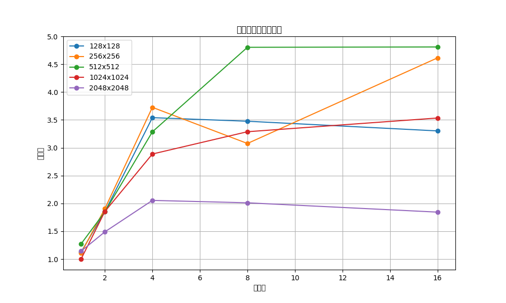
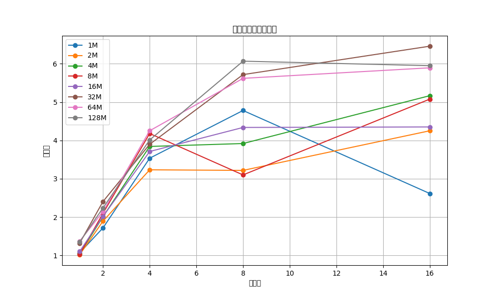

# 并行计算实验报告

姓名：蔡可豪  
学号：22336018

## 实验环境

- 操作系统：macOS 24.4.0
- 处理器：Apple M1
- 编译器：GCC with -O3 优化
- 并行库：POSIX Threads (Pthreads)

## 实验目的

1. 实现并评估基于 Pthreads 的并行矩阵乘法算法
2. 实现并评估基于 Pthreads 的并行数组求和算法
3. 分析不同问题规模和线程数对并行性能的影响

## 实验方法

### 实验1：矩阵乘法

#### 实现思路

1. 数据结构设计：
```c
typedef struct {
    int rows;
    int cols;
    double** data;
} Matrix;

typedef struct {
    int thread_id;
    int num_threads;
    Matrix* A;
    Matrix* B;
    Matrix* C;
} ThreadArgs;
```
- 使用二维数组存储矩阵数据
- 线程参数结构体包含任务划分信息和矩阵指针

2. 并行化策略：
```c
void* matrix_multiply_thread(void* arg) {
    ThreadArgs* args = (ThreadArgs*)arg;
    int start_row = (args->thread_id * args->A->rows) / args->num_threads;
    int end_row = ((args->thread_id + 1) * args->A->rows) / args->num_threads;
    // ... 计算部分省略 ...
}
```
- 按行划分任务，每个线程负责一段连续的行
- 使用静态任务分配，减少调度开销
- 每个线程独立计算自己负责的行，无需同步

3. 性能优化：
- 编译时开启 -O3 优化
- 避免频繁的内存分配和释放
- 使用连续的内存访问模式提高缓存命中率

### 实验2：数组求和

#### 实现思路

1. 数据结构设计：
```c
typedef struct {
    int thread_id;
    int num_threads;
    double* array;
    long long size;
    double partial_sum;
} ThreadArgs;
```
- 使用一维数组存储数据
- 线程参数结构体包含部分和，避免使用全局变量

2. 并行化策略：
```c
void* array_sum_thread(void* arg) {
    ThreadArgs* args = (ThreadArgs*)arg;
    long long start_idx = (args->thread_id * args->size) / args->num_threads;
    long long end_idx = ((args->thread_id + 1) * args->size) / args->num_threads;
    // ... 计算部分省略 ...
}
```
- 数组均匀划分给各个线程
- 每个线程计算局部和
- 主线程汇总所有局部和

3. 性能优化：
- 使用局部变量存储部分和，减少内存访问
- 连续的内存访问模式
- 避免线程间的数据竞争

### 关键实现细节

1. 时间测量：
```c
struct timeval start, end;
gettimeofday(&start, NULL);
// ... 计算过程 ...
gettimeofday(&end, NULL);
double time_taken = (end.tv_sec - start.tv_sec) + 
                   (end.tv_usec - start.tv_usec) / 1000000.0;
```
- 使用 gettimeofday 获取微秒级精度
- 考虑了秒和微秒的转换

2. 线程管理：
```c
pthread_t* threads = (pthread_t*)malloc(num_threads * sizeof(pthread_t));
ThreadArgs* thread_args = (ThreadArgs*)malloc(num_threads * sizeof(ThreadArgs));

for (int i = 0; i < num_threads; i++) {
    // ... 初始化线程参数 ...
    pthread_create(&threads[i], NULL, thread_function, &thread_args[i]);
}

for (int i = 0; i < num_threads; i++) {
    pthread_join(threads[i], NULL);
}
```
- 动态分配线程数组和参数数组
- 使用 pthread_create 创建线程
- 使用 pthread_join 等待所有线程完成
- 注意释放动态分配的内存

3. 数据初始化：
```c
void init_matrix(Matrix* mat) {
    for (int i = 0; i < mat->rows; i++) {
        for (int j = 0; j < mat->cols; j++) {
            mat->data[i][j] = (double)rand() / RAND_MAX;
        }
    }
}
```
- 使用随机数填充数据
- 确保数据范围在 [0,1] 之间

## 实验结果与分析

### 实验1：矩阵乘法

#### 加速比分析



从图中可以观察到：

1. 随着矩阵规模的增加，并行算法的加速比普遍提高
2. 对于较小的矩阵（128x128），由于并行开销，加速效果不明显
3. 对于较大的矩阵（1024x1024、2048x2048），在使用多线程时能获得较好的加速效果
4. 线程数增加到8或16时，加速比的增长趋势变缓，这可能是由于：
   - 线程调度开销
   - 内存访问竞争
   - 处理器核心数的限制

#### 并行效率分析

详细数据见 matrix_efficiency.csv

并行效率随着线程数的增加而降低，这是由于：
1. 线程管理开销
2. 负载不均衡
3. 内存访问竞争
4. 同步开销

### 实验2：数组求和

#### 加速比分析



从图中可以观察到：

1. 数组规模对加速比的影响较大
2. 较小规模（1M-4M）的数组，加速效果不明显
3. 较大规模（32M-128M）的数组，可以获得较好的加速效果
4. 加速比普遍低于矩阵乘法，这是因为：
   - 数组求和是内存密集型任务
   - 计算密度较低
   - 内存带宽成为瓶颈

#### 并行效率分析

详细数据见 array_efficiency.csv

数组求和的并行效率普遍低于矩阵乘法，主要原因：
1. 内存访问延迟
2. 内存带宽限制
3. 计算与通信比较低

## 实验结论

1. 并行计算的效果与问题规模密切相关：
   - 较大的问题规模通常能获得更好的加速效果
   - 较小的问题规模可能因为并行开销而得不到加速

2. 计算密集型任务（如矩阵乘法）比内存密集型任务（如数组求和）更适合并行化：
   - 计算密集型任务的并行效率更高
   - 内存密集型任务容易受到内存带宽的限制

3. 线程数的增加不一定带来性能的线性提升：
   - 线程管理开销
   - 资源竞争
   - 负载均衡问题

## 改进建议

1. 矩阵乘法优化：
   - 使用分块算法提高缓存利用率
   - 实现更均衡的任务分配策略
   - 考虑使用 SIMD 指令进行优化

2. 数组求和优化：
   - 使用局部求和减少内存访问
   - 优化数据布局提高缓存命中率
   - 考虑使用向量化指令

3. 通用优化：
   - 根据处理器核心数动态调整线程数
   - 实现自适应的负载均衡策略
   - 减少线程同步开销

