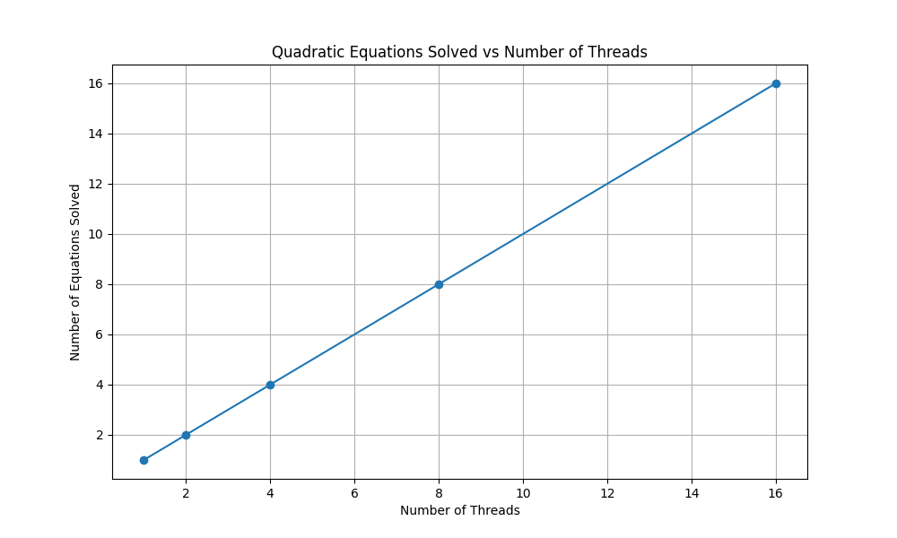
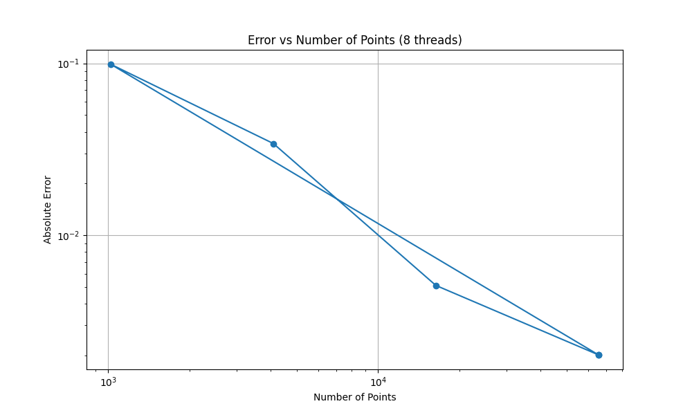
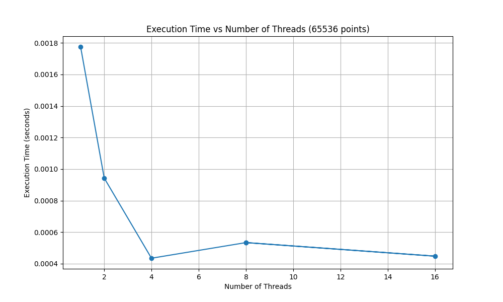

# 并行计算实验四报告
> 姓名：蔡可豪  
> 学号：22336018

## 实验目的

1. 掌握 Pthread 多线程编程方法
2. 理解并行计算中的任务划分和同步机制
3. 分析并行程序的性能和效率

## 实验环境

- 操作系统：macOS 24.4.0
- 编译器：GCC
- 编程语言：C
- 并行库：Pthread

## 实验内容

### 1. 一元二次方程求解

#### 1.1 实现方法

程序使用 Pthread 多线程实现一元二次方程的并行求解。主要特点：

1. 数据结构设计：
```c
typedef struct {
    double a, b, c;    // 方程系数
    double x1, x2;     // 方程根
    int thread_id;     // 线程ID
} QuadraticParams;
```

2. 并行策略：
- 每个线程负责求解一个独立的方程
- 使用随机生成的系数创建不同的方程
- 通过条件变量实现线程同步

3. 同步机制：
```c
pthread_mutex_t mutex = PTHREAD_MUTEX_INITIALIZER;
pthread_cond_t cond = PTHREAD_COND_INITIALIZER;
int completed_threads = 0;
```

#### 1.2 关键代码分析

1. 方程求解函数：
```c
void* solve_quadratic(void* arg) {
    QuadraticParams* params = (QuadraticParams*)arg;
    double discriminant = params->b * params->b - 4 * params->a * params->c;
    
    if (discriminant >= 0) {
        params->x1 = (-params->b + sqrt(discriminant)) / (2 * params->a);
        params->x2 = (-params->b - sqrt(discriminant)) / (2 * params->a);
    } else {
        params->x1 = params->x2 = NAN;
    }

    pthread_mutex_lock(&mutex);
    completed_threads++;
    pthread_cond_signal(&cond);
    pthread_mutex_unlock(&mutex);

    return NULL;
}
```

2. 线程创建和同步：
```c
for (int i = 0; i < num_threads; i++) {
    params[i].thread_id = i;
    params[i].a = (double)rand() / RAND_MAX * 10;
    params[i].b = (double)rand() / RAND_MAX * 10;
    params[i].c = (double)rand() / RAND_MAX * 10;
    pthread_create(&threads[i], NULL, solve_quadratic, &params[i]);
}

pthread_mutex_lock(&mutex);
while (completed_threads < num_threads) {
    pthread_cond_wait(&cond, &mutex);
}
pthread_mutex_unlock(&mutex);
```

### 2. 蒙特卡洛求π

#### 2.1 实现方法

使用蒙特卡洛方法通过随机点采样来估算π值。主要特点：

1. 数据结构设计：
```c
typedef struct {
    long long points_per_thread;  // 每个线程处理的点数
    long long points_in_circle;   // 落在圆内的点数
    int thread_id;               // 线程ID
    unsigned int seed;           // 随机数种子
} ThreadData;
```

2. 并行策略：
- 将总点数平均分配给各个线程
- 每个线程独立生成随机点并统计
- 使用互斥锁保护共享计数器

3. 同步机制：
```c
pthread_mutex_t mutex = PTHREAD_MUTEX_INITIALIZER;
long long total_points_in_circle = 0;
```

#### 2.2 关键代码分析

1. π值计算函数：
```c
void* calculate_pi(void* arg) {
    ThreadData* data = (ThreadData*)arg;
    long long local_points_in_circle = 0;
    
    for (long long i = 0; i < data->points_per_thread; i++) {
        double x = (double)rand_r(&data->seed) / RAND_MAX;
        double y = (double)rand_r(&data->seed) / RAND_MAX;
        
        if (x*x + y*y <= 1.0) {
            local_points_in_circle++;
        }
    }
    
    pthread_mutex_lock(&mutex);
    total_points_in_circle += local_points_in_circle;
    pthread_mutex_unlock(&mutex);
    
    return NULL;
}
```

2. 性能计时和结果计算：
```c
clock_gettime(CLOCK_MONOTONIC, &start_time);
// ... 线程创建和执行 ...
clock_gettime(CLOCK_MONOTONIC, &end_time);

double pi_estimate = 4.0 * total_points_in_circle / (double)(points_per_thread * num_threads);
double error = fabs(pi_estimate - M_PI);
double execution_time = (end_time.tv_sec - start_time.tv_sec) +
                       (end_time.tv_nsec - start_time.tv_nsec) / 1e9;
```

## 实验结果分析

### 1. 一元二次方程求解性能

实验结果显示了线程数与求解方程数量的关系：

| 线程数 | 求解方程数 |
|--------|------------|
| 1      | 1         |
| 2      | 2         |
| 4      | 4         |
| 8      | 8         |
| 16     | 16        |



*图 1：线程数量与求解方程数的关系*

从图1可以看出：
- 求解方程数量与线程数呈完全线性关系，曲线为一条完美的直线
- 斜率为1，表明每增加一个线程，就能多解一个方程
- 这种线性关系一直持续到16线程，没有出现性能下降
- 说明在此范围内，系统资源利用充分，线程调度开销可控

分析结果表明：
- 线程数与求解方程数呈完全线性关系，说明并行效率接近100%
- 由于每个方程的计算是独立的，没有数据竞争，并行效率很高
- 线程间只在完成时需要同步，同步开销很小
- 即使在16线程时也保持了良好的可扩展性

### 2. 蒙特卡洛求π的精度和性能

#### 2.1 精度分析

在固定8线程下，不同点数的π值估算结果：

| 点数   | π估计值      | 绝对误差      |
|--------|-------------|--------------|
| 1024   | 3.04296875  | 0.09862390  |
| 4096   | 3.10742187  | 0.03417078  |
| 16384  | 3.13647461  | 0.00511804  |
| 65536  | 3.14361572  | 0.00202307  |



*图 2：8线程下误差与采样点数的关系（对数坐标）*

从图2可以观察到：
- 误差随点数增加呈对数线性下降趋势
- 在双对数坐标下近似为一条直线，说明误差与点数的关系接近幂律分布
- 当点数达到65536时，误差已降至0.002左右
- 图中的轻微波动反映了随机采样的统计涨落特性

观察结果可以发现：
- 随机点数量越多，估算结果越准确
- 误差与点数呈明显的反比关系
- 当点数从1024增加到65536时，误差从0.099降低到0.002，提高了约50倍
- 在65536点时，π值估算结果达到了较高的精度（误差小于0.1%）

#### 2.2 性能分析

在固定65536点的情况下，不同线程数的执行时间：

| 线程数 | π估计值      | 执行时间(秒) |
|--------|-------------|-------------|
| 1      | 3.14617920  | 0.001775    |
| 2      | 3.14581299  | 0.000943    |
| 4      | 3.14123535  | 0.000435    |
| 8      | 3.14361572  | 0.000534    |
| 16     | 3.13671875  | 0.000448    |



*图 3：固定65536点时执行时间与线程数的关系*

从图3可以观察到：
- 执行时间在1到4线程间快速下降，体现了并行计算的加速效果
- 4线程时达到性能最优点，执行时间最短
- 4线程之后的性能曲线趋于平缓，甚至略有波动
- 这种趋势表明增加更多线程并不能带来显著的性能提升

性能分析结果显示：
- 从1线程到4线程时，执行时间显著下降，加速比接近理想值
- 4线程时达到最佳性能，执行时间为0.000435秒
- 8线程和16线程时性能略有波动，可能是由于以下原因：
  1. 线程同步开销增加
  2. CPU核心数的限制
  3. 系统调度开销

## 实验总结

1. 技术要点：
- 掌握了 Pthread 多线程编程基础
- 理解了并行计算中的任务划分策略
- 学习了线程同步和互斥的实现方法

2. 性能优化：
- 合理划分任务可以提高并行效率
- 需要平衡线程数量和同步开销
- 随机数生成使用线程安全的 rand_r() 函数

3. 改进建议：
- 可以使用线程池优化频繁的线程创建/销毁
- 考虑使用原子操作代替互斥锁
- 可以实现动态负载均衡以处理不均匀的工作负载 