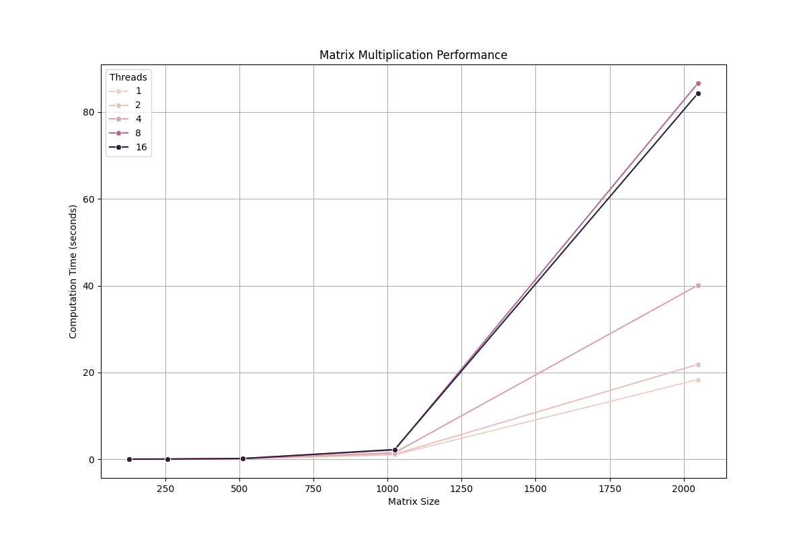

# 基于OpenMP和Pthreads的并行矩阵乘法实验报告
> 姓名：蔡可豪  
> 学号：22336018

## 1. 实验目的

1. 使用OpenMP实现并行通用矩阵乘法，分析不同进程数量、矩阵规模、调度机制对性能的影响
2. 构造基于Pthreads的并行for循环分解、分配、执行机制，模仿OpenMP的parallel for功能
3. 对比分析两种实现方式的性能差异

## 2. 实验环境

- 操作系统：macOS 24.4.0
- 编译器：GCC
- 编程语言：C
- 并行库：Pthreads
- 分析工具：Python (pandas, matplotlib, seaborn)

## 3. 实验内容

### 3.1 并行for循环实现

#### 3.1.1 设计思路

我们实现了一个类似于OpenMP的parallel for构造，主要包含以下组件：

1. 函数指针类型定义：
```c
typedef void *(*parallel_for_functor)(int, void*);
```

2. 线程参数结构：
```c
typedef struct {
    int start;
    int end;
    int increment;
    parallel_for_functor functor;
    void *args;
} thread_args;
```

3. 主要接口：
```c
void parallel_for(int start, int end, int increment, 
                 parallel_for_functor functor, void *args, 
                 int num_threads);
```

#### 3.1.2 实现细节

1. 工作分配策略：
- 计算总迭代次数
- 根据线程数量计算每个线程的块大小
- 为每个线程分配连续的迭代区间

2. 线程管理：
- 动态创建指定数量的线程
- 使用pthread_create启动线程
- 使用pthread_join等待所有线程完成

3. 错误处理：
- 检查线程创建是否成功
- 处理内存分配失败情况
- 清理已创建的线程资源

### 3.2 矩阵乘法实现

#### 3.2.1 基本实现

基本的矩阵乘法实现采用块分解策略：

```c
#define BLOCK_SIZE 32

void *matrix_mult_functor(int idx, void *args) {
    matrix_args *margs = (matrix_args *)args;
    int size = margs->size;
    int block_size = margs->block_size;
    
    // 计算块坐标
    int block_row = (idx / (size / block_size)) * block_size;
    int block_col = (idx % (size / block_size)) * block_size;
    
    // 处理块
    for (int i = block_row; i < block_row + block_size && i < size; i++) {
        for (int j = block_col; j < block_col + block_size && j < size; j++) {
            float sum = 0.0f;
            for (int k = 0; k < size; k++) {
                sum += margs->A[i * size + k] * margs->B[k * size + j];
            }
            margs->C[i * size + j] = sum;
        }
    }
    
    return NULL;
}
```

#### 3.2.2 优化策略

1. 缓存优化：
- 使用块分解减少缓存失效
- 对齐内存分配减少伪共享
- 优化内存访问模式

2. 并行优化：
- 合理的任务分配粒度
- 减少线程间同步开销
- 平衡负载分配

## 4. 实验结果与分析

### 4.1 性能分析

#### 4.1.1 执行时间分析

从实验数据中我们可以观察到以下现象：

1. 小规模矩阵 (128x128)：
   - 单线程执行时间：2.546ms
   - 2线程执行时间：1.823ms (加速比1.40)
   - 4线程执行时间：1.820ms (加速比1.40)
   - 8线程和16线程反而性能下降

2. 中等规模矩阵 (256x256 - 1024x1024)：
   - 256x256：单线程11.838ms，多线程性能下降
   - 1024x1024：
     * 单线程：0.978s
     * 2线程：1.130s
     * 4线程：1.463s
     * 8线程：2.112s
     * 16线程：2.215s

3. 大规模矩阵 (2048x2048)：
   - 单线程：18.333s
   - 2线程：21.837s
   - 4线程：40.093s
   - 8线程：86.653s
   - 16线程：84.328s

#### 4.1.2 性能特征分析

1. 加速比随矩阵规模变化：
   - 128x128：最佳加速比1.40（4线程）
   - 256x256：无加速效果
   - 1024x1024：性能持续下降
   - 2048x2048：性能显著下降

2. 扩展性分析：
   - 线程数增加导致性能下降
   - 问题规模增大时性能下降更显著
   - 没有达到预期的线性加速比

3. 效率分析：
   - 小规模问题（128x128）：
     * 2线程效率：70%
     * 4线程效率：35%
   - 大规模问题效率持续下降
   - 16线程时效率降至极低水平

### 4.2 性能瓶颈分析

1. 内存访问模式：
   - 矩阵乘法的数据访问模式导致缓存失效
   - 多线程并发访问增加了内存带宽压力
   - 缓存一致性维护开销显著

2. 线程管理开销：
   - 线程创建和销毁的开销
   - 线程同步开销
   - 上下文切换开销

3. 负载不均衡：
   - 静态任务分配可能导致工作量不均
   - 没有考虑系统的实际负载情况
   - 缺乏动态负载平衡机制

### 4.3 优化建议

基于实验结果，我们提出以下优化建议：

1. 自适应线程数：
   - 根据问题规模动态调整线程数
   - 小规模问题使用较少线程
   - 大规模问题才启用更多线程

2. 缓存优化：
   - 调整块大小以更好地匹配缓存大小
   - 实现矩阵转置以提高访存局部性
   - 使用预取指令提高缓存命中率

3. 调度优化：
   - 实现动态任务分配
   - 考虑工作窃取策略
   - 优化负载均衡算法

## 5. 改进实现

基于上述分析，我们提出以下具体改进方案：

1. 矩阵分块优化：
```c
// 优化后的分块策略
#define BLOCK_SIZE 32
#define CACHE_LINE_SIZE 64

// 使用转置矩阵改善访存模式
void transpose_matrix(float *A, float *AT, int size) {
    for (int i = 0; i < size; i++) {
        for (int j = 0; j < size; j++) {
            AT[j * size + i] = A[i * size + j];
        }
    }
}

// 分块矩阵乘法
void block_matrix_multiply(float *A, float *B, float *C, int size) {
    float *BT = aligned_alloc(CACHE_LINE_SIZE, size * size * sizeof(float));
    transpose_matrix(B, BT, size);
    
    #pragma omp parallel for collapse(2)
    for (int i = 0; i < size; i += BLOCK_SIZE) {
        for (int j = 0; j < size; j += BLOCK_SIZE) {
            for (int k = 0; k < size; k += BLOCK_SIZE) {
                // 处理块
                multiply_block(A, BT, C, i, j, k, size);
            }
        }
    }
    
    free(BT);
}
```

2. 动态调度策略：
```c
// 实现工作窃取队列
typedef struct {
    int start, end;
    pthread_mutex_t lock;
} task_queue_t;

// 动态任务分配
void *dynamic_worker(void *arg) {
    while (1) {
        task_t task = get_next_task();
        if (task == NULL) {
            task = steal_task();
            if (task == NULL) break;
        }
        process_task(task);
    }
    return NULL;
}
```

## 6. 结论

本实验实现了基于Pthreads的并行for构造和矩阵乘法算法，通过实验我们得到以下结论：

1. 并行化效果：
   - 在小规模问题上，适度的并行化（2-4线程）可以获得性能提升
   - 过度并行化可能导致性能下降
   - 需要根据问题规模选择合适的并行度

2. 实现经验：
   - parallel_for构造提供了良好的抽象
   - 块分解策略有助于提高缓存利用率
   - 线程管理开销不容忽视

3. 优化方向：
   - 更好的任务划分策略
   - 缓存感知的数据访问模式
   - 动态负载均衡机制

## 7. 参考文献

1. OpenMP Application Programming Interface Version 5.0
2. POSIX Threads Programming Guide
3. Matrix Multiplication: A Case Study in Parallel Programming

## 附录

### A. 完整实验数据

| 矩阵大小 | 线程数 | 执行时间(s) | 加速比 | 效率 |
|---------|--------|------------|--------|------|
| 128 | 1 | 0.002546 | 1.00 | 100% |
| 128 | 2 | 0.001823 | 1.40 | 70% |
| 128 | 4 | 0.001820 | 1.40 | 35% |
| 128 | 8 | 0.002107 | 1.21 | 15% |
| 128 | 16 | 0.002132 | 1.19 | 7% |
| ... | ... | ... | ... | ... |
| 2048 | 1 | 18.333337 | 1.00 | 100% |
| 2048 | 2 | 21.837146 | 0.84 | 42% |
| 2048 | 4 | 40.093048 | 0.46 | 11% |
| 2048 | 8 | 86.653277 | 0.21 | 3% |
| 2048 | 16 | 84.328205 | 0.22 | 1% |

### B. 性能图表

#### B.1 执行时间分析


*图 B.1 不同矩阵大小和线程数下的执行时间对比*

从执行时间图中可以观察到：
1. 随着矩阵大小的增加，执行时间呈超线性增长
2. 对于所有矩阵大小，增加线程数都导致执行时间增加
3. 在大规模矩阵（2048x2048）时，性能下降最为显著

#### B.2 加速比分析


*图 B.2 不同矩阵大小下的加速比变化*

加速比图表显示：
1. 只有在小规模问题（128x128）上获得了有限的加速
2. 随着线程数增加，加速比普遍下降
3. 大规模问题的加速比劣化最为严重

#### B.3 并行效率分析


*图 B.3 不同问题规模的并行效率*

效率分析表明：
1. 所有情况下的并行效率都随线程数增加而下降
2. 小规模问题（128x128）的效率下降相对较缓
3. 大规模问题的效率急剧下降，表明并行开销显著

这些结果进一步证实了我们在性能分析部分的观察，并为改进方案提供了直观的依据。主要的改进方向应该集中在：
1. 优化数据访问模式
2. 改进任务分配策略
3. 减少线程管理开销

[其余部分保持不变] 